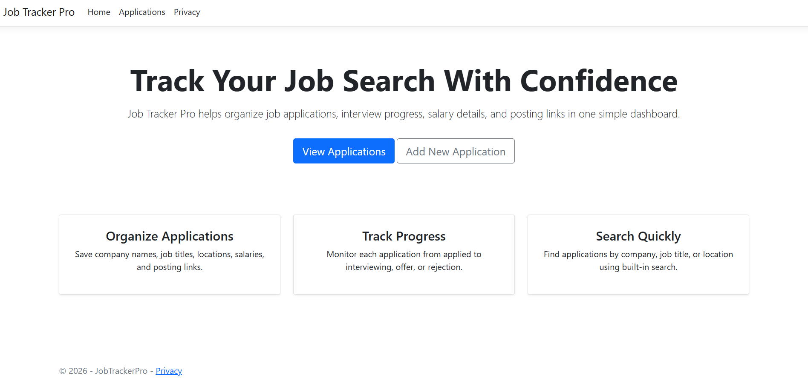
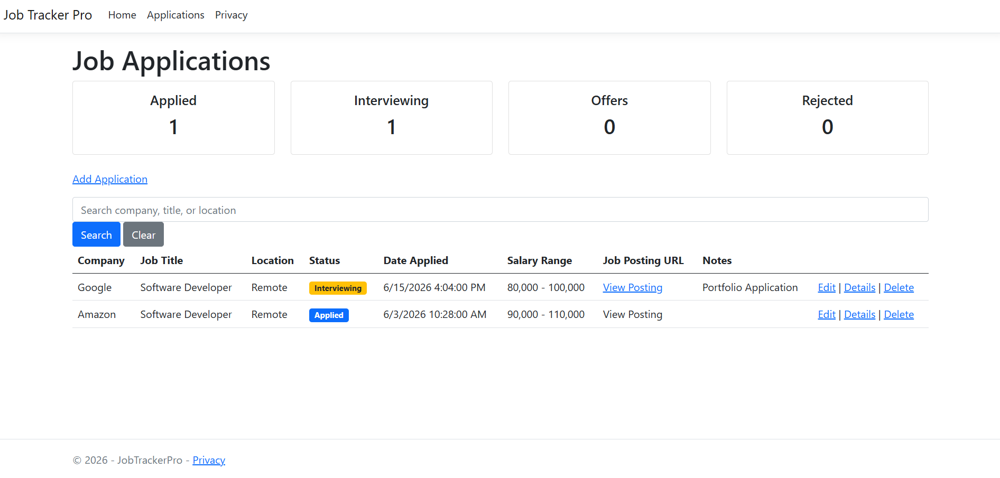
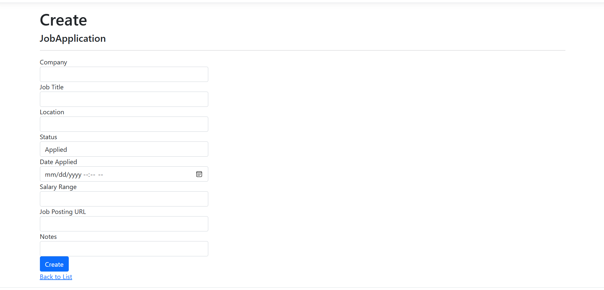

# Job Application Tracker

A full-stack ASP.NET Core MVC web application for tracking job applications, interview progress, offers, and rejections.

## Features

- Add, edit, and delete job applications
- Search by company, job title, or location
- Dashboard statistics
- Status tracking
  - Applied
  - Interviewing
  - Offer Received
  - Rejected
- SQLite database storage
- Entity Framework Core integration
- Responsive Bootstrap UI

## Technologies Used

- ASP.NET Core MVC
- C#
- Entity Framework Core
- SQLite
- Bootstrap

## Screenshots

### Home Page

### Dashboard

### Create Application

## Future Improvements

- User authentication
- Role-based access
- Email reminders
- Application analytics charts
- Cloud database support

## Author

Ashley Carroway
